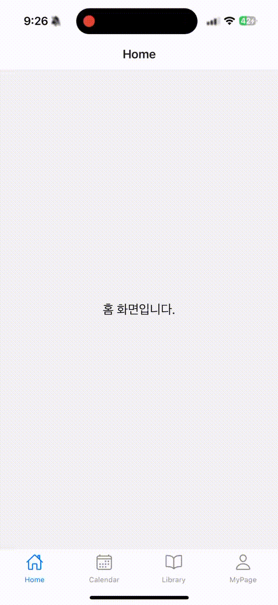
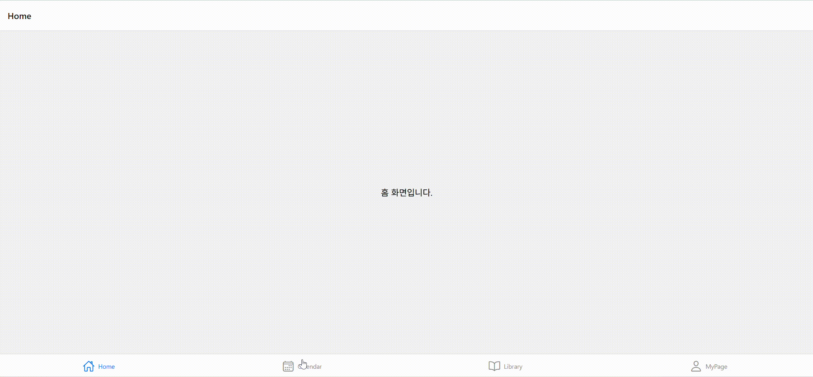

# 📆 Native Calendar App

React Native로 Calendar를 구현한 프로젝트입니다.

---

## 📸 데모

- iOS  
  

- Web  
  

---

## 📌 프로젝트 소개

- React Native 기반의 슬라이딩 캘린더
- 월/주 보기 전환, 좌우 전환, 애니메이션 구현

## 🛠️ 기술 스택

- React Native
- React Native Reanimated
- react-native-gesture-handler
- TypeScript

## 🚀 설치 및 실행

```
yarn install
yarn start
```

## 📁 프로젝트 구조
| 폴더명              | 폴더 설명 |
|-------------------|-----------|
| `assets`          | 이미지, GIF, 아이콘 등 정적 리소스를 저장하는 폴더 |
| `components`      | 분리 가능한 컴포넌트를 저장 |
| `screens`         | Navigator에 의해 이동 가능한 화면들을 저장 |
| `types`           | 컴포넌트나 스크린에서 사용할 타입을 저장 |
| `utils`           | 공통 유틸리티 함수들을 모아놓는 폴더 |
---
